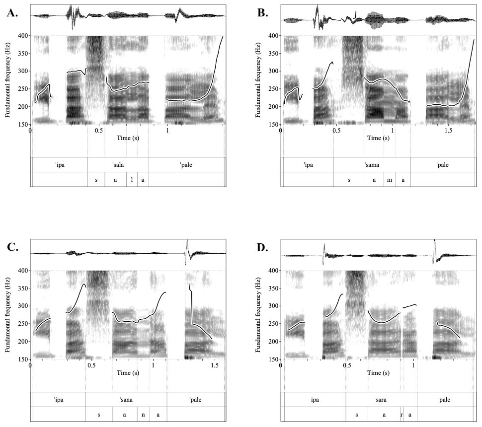

# Introduction
This repository contains the code for "Sonorant spectra and coarticulation distinguish speakers with different dialects". 

# Abstract
The aim of this study is to determine the effect of language varieties on the spectral distribution of stressed and unstressed sonorants (nasals /m, n/, lateral approximants /l/, and rhotics /r/) and on their coarticulatory effects on adjacent sounds. To quantify the shape of the spectral distribution, we calculated the spectral moments from the sonorant spectra of nasals /m, n/, lateral approximants /l/, and rhotics /r/ produced by Athenian Greek and Cypriot Greek speakers. To estimate the co-articulatory effects of sonorants on the adjacent vowels’ F1 - F4 formant frequencies, we developed polynomial models of the adjacent vowel’s formant contours. We found significant effects of language variety (sociolinguistic information) on the spectral moments of each sonorant /m/, /n/, /l/, /r/ (except between /m/ and /n/) and on the formant contours of the adjacent vowel. All sonorants (including /m/ and /n/) had distinct effects on adjacent vowel’s formant contours, especially for F3 and F4. The study highlights that the combination of spectral moments and coarticulatory effects of sonorants determines linguistic (stress and phonemic category) and sociolinguistic (language variety) characteristics of sonorants. It also provides the first comparative acoustic analysis of Athenian Greek and Cypriot Greek sonorants.

## Updated
Oct 02 2021: 
- Names of speakers were removed from the datafile and substituted with code stamps: s1 ... s40. 
- Paper has been updated.

# Instructions
This repository contains the R code for the paper. To run you need to install R and Rstudio. In case you do not have the appropriate packages to run the code, Rstudio will prompt you to install the appropriate packages, please press install.

For questions and support with the code please email: Charalambos Themistocleous themistocleous at gmail.com

# Cite

Themistocleous, Charalambos, Fyndanis Valantis, Tsapkini Kyrana (2021). Sonorant spectra and coarticulation distinguish speakers with different dialects